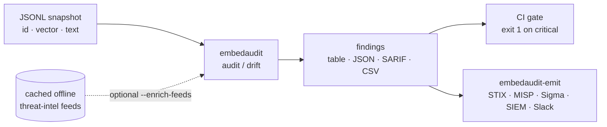

<a name="top"></a>

<div align="center">


# EMBEDAUDIT


### Embedding / vector-store drift and poisoning audit


[](https://pypi.org/project/cognis-embedaudit/) [](https://github.com/cognis-digital/embedaudit/actions) [](LICENSE) [](https://github.com/cognis-digital)


*Data & Datasets — zero-setup quality, lineage, and governance.*


</div>


```bash

pip install cognis-embedaudit

embedaudit audit snapshot.jsonl     # → prioritized poisoning/drift findings in ms

```


<!-- cognis:example:start -->
## 🔎 Example output

Real, reproducible output from the tool — runs offline:

```console
$ embedaudit-emit --version
embedaudit 1.4.0
```

```console
$ embedaudit-emit --help
usage: embedaudit [-h] [--version] [--format {table,json,sarif,csv}]
                  {audit,drift,feeds,mcp} ...

Embedding / vector-store drift and poisoning audit.

positional arguments:
  {audit,drift,feeds,mcp}
    audit               audit a single store snapshot (JSONL of vectors)
    drift               compare a baseline snapshot against a current snapshot
    feeds               list the bundled offline threat-intel feed catalog
    mcp                 run the MCP stdio server (needs [mcp] extra)

options:
  -h, --help            show this help message and exit
  --version             show program's version number and exit
  --format {table,json,sarif,csv}
                        output format (default: table)
```

```console
$ embedaudit-emit feeds
feed catalog (offline) — 18 relevant feed(s)
  [threat-intel] attack-enterprise      stix   https://raw.githubusercontent.com/mitre-attack/attack-stix-data/master/enterprise-attack/enterprise-attack.json
  [threat-intel] feodo-c2               json   https://feodotracker.abuse.ch/downloads/ipblocklist.json
  [threat-intel] threatfox              json   https://threatfox.abuse.ch/export/json/recent/
  [threat-intel] urlhaus                json   https://urlhaus.abuse.ch/downloads/json_recent/
  [threat-intel] sslbl                  csv    https://sslbl.abuse.ch/blacklist/sslblacklist.csv
  [osint       ] ofac-sdn               csv    https://www.treasury.gov/ofac/downloads/sdn.csv
  [osint       ] gdelt                  text   http://data.gdeltproject.org/gdeltv2/lastupdate.txt
  [osint       ] opensky-states         json   https://opensky-network.org/api/states/all
  [threat-intel] spamhaus-drop          text   https://www.spamhaus.org/drop/drop.txt
  [threat-intel] tor-exit-nodes         text   https://check.torproject.org/torbulkexitlist
  [threat-intel] sslbl-ja3              csv    https://sslbl.abuse.ch/blacklist/ja3_fingerprints.csv
  [threat-intel] urlhaus-recent         json   https://urlhaus.abuse.ch/downloads/json_recent/
  [threat-intel] attack-mobile          stix   https://raw.githubusercontent.com/mitre-attack/attack-stix-data/master/mobile-attack/mobile-attack.json
  [threat-intel] attack-ics             stix   https://raw.githubusercontent.com/mitre-attack/attack-stix-data/master/ics-attack/ics-attack.json
  [osint       ] usgs-earthquakes       geojson https://earthquake.usgs.gov/fdsnws/event/1/query?format=geojson&minmagnitude=4
  [osint       ] noaa-weather-alerts    geojson https://api.weather.gov/alerts/active
  [osint       ] reliefweb-disasters    json   https://api.reliefweb.int/v2/disasters?appname=cognis-digital&limit=50
  [osint       ] openfda-enforcement    json   https://api.fda.gov/drug/enforcement.json?limit=100
```

> Blocks above are real `embedaudit` output — reproduce them from a clone.

<!-- cognis:example:end -->

## Usage — step by step

1. **Install** the CLI:
   ```bash
   pip install embedaudit
   ```

2. **Audit a snapshot** of your vector store — a JSONL file of embedding records — for near-duplicates and single-vector domination:
   ```bash
   embedaudit audit snapshot.jsonl --dup-threshold 0.999 --domination-share 0.30
   ```

3. **Compare against a trusted baseline** to catch drift / poisoning between two snapshots:
   ```bash
   embedaudit drift baseline.jsonl current.jsonl --drift-threshold 0.15
   ```

4. **Read the output.** Add `--format json` for a machine-readable report and a non-zero exit code when findings exceed your thresholds:
   ```bash
   embedaudit audit snapshot.jsonl --format json > report.json
   ```

5. **Wire it into CI** — fail the build when an index regresses:
   ```bash
   embedaudit drift baseline.jsonl current.jsonl --format json || exit 1
   ```

## Contents


- [Why embedaudit?](#why) · [Features](#features) · [Quick start](#quick-start) · [Example](#example) · [Architecture](#architecture) · [AI stack](#ai-stack) · [How it compares](#how-it-compares) · [Edge / air-gap](#edge) · [Scope & safety](#scope) · [Integrations](#integrations) · [Install anywhere](#install-anywhere) · [Related](#related) · [Contributing](#contributing)


<a name="why"></a>

## Why embedaudit?


RAG retrieval is only as trustworthy as the vector store behind it — and that
store is a soft target. A handful of crafted "universal" documents can dominate
top-k retrieval; a silent embedding-model swap shifts the whole space; a broken
embed pipeline quietly writes zero/NaN vectors; duplicates bloat the index. None
of this shows up in a row count.


`embedaudit` is the integrity check for that store. It's single-purpose,
scriptable, and self-hostable: point it at a JSONL snapshot, get prioritized
findings in the format your workflow already speaks (table · JSON · SARIF · CSV),
gate CI on the exit code, and let agents drive it over MCP. Pure standard
library — no model, no GPU, no network.


<div align="right"><a href="#top">↑ back to top</a></div>


<a name="features"></a>
<a name="findings"></a>

## Features


`embedaudit` reads a **JSONL snapshot of your vector store** — one
`{"id", "vector", "text"}` record per line, exported from FAISS / pgvector /
Chroma / Pinecone / Weaviate / Qdrant or any pipeline — and runs a pure-math
integrity + poisoning audit. No model, no GPU, no network.


- ✅ **`audit`** a single snapshot for poisoning & corruption:

  - `ZERO_VECTOR` — un-embeddable / failed-embed records (critical)

  - `INVALID_VALUE` — NaN / Inf coordinates (critical)

  - `DIM_MISMATCH` — mixed dimensions = silent model swap / corrupt write (critical)

  - `RETRIEVAL_DOMINATION` — a near-identical cluster owning a large share of the store → top-k hijack / universal-poison docs (critical)

  - `DUPLICATE_VECTOR` — index bloat / retrieval flooding (warning)

  - `NORM_OUTLIER` / `OUTLIER_VECTOR` — mis-scaled or off-topic injected vectors (warning)

- ✅ **`drift`** a current snapshot against a trusted baseline — centroid distance + per-dimension shift → `DRIFT` / `RECORD_LOSS` (catches silent model swaps on an append-only store)

- ✅ **Output formats**: `table` (human) · `json` · **`sarif`** (GitHub code-scanning) · `csv` (SIEM / spreadsheets)

- ✅ **Deterministic CI gate**: non-zero exit when any `critical` finding is present

- ✅ **Edge / air-gap**: optional offline threat-intel enrichment (`--enrich-feeds`) from a cached, keyless feed catalog — see [Edge / air-gap](#edge)

- ✅ **`embedaudit-emit`** forwards findings to STIX/MISP/Sigma/Splunk/Elastic/Slack/webhook via [cognis-connect](https://github.com/cognis-digital/cognis-connect)

- ✅ **MCP server** (`embedaudit mcp`) exposes `audit` / `drift` as tools

- ✅ Runs on Linux/macOS/Windows · Docker · devcontainer · pure stdlib (Python 3.10+)

- ✅ Verified ports in **Python, JavaScript/Node, Go, and Rust** (`ports/`), CI-tested on every push


<div align="right"><a href="#top">↑ back to top</a></div>


<a name="quick-start"></a>

## Quick start


```bash

pip install cognis-embedaudit

embedaudit --version

embedaudit audit snapshot.jsonl                 # human table; exits 1 on critical

embedaudit audit snapshot.jsonl --format json   # machine-readable

embedaudit audit snapshot.jsonl --format sarif  # GitHub code-scanning

embedaudit drift baseline.jsonl current.jsonl   # poisoning / model-swap vs baseline

```


Snapshot format — one JSON object per line:


```jsonl

{"id": "doc-1", "vector": [0.91, 0.10, 0.05, 0.02], "text": "How do I reset my password?"}

{"id": "doc-2", "vector": [0.12, 0.88, 0.07, 0.03], "text": "Billing invoice for March"}

```


<div align="right"><a href="#top">↑ back to top</a></div>


<a name="example"></a>

## Example


Audit the bundled poisoned demo store (`demos/01-basic/store_snapshot.jsonl` —
11 records: clean docs, one failed embed, and a 5-vector poison cluster):


```text

$ embedaudit audit demos/01-basic/store_snapshot.jsonl

== AUDIT demos/01-basic/store_snapshot.jsonl ==

records   : 11

dimension : 4

status    : FAIL

stats     :

  mean_norm              0.8815

  std_norm               0.2816

  duplicate_pairs        1

  largest_cluster        5

  largest_cluster_share  0.4545

findings  :

  [CRITICAL] ZERO_VECTOR: 1 zero-norm vector(s) (un-embeddable / corrupt)

  [CRITICAL] RETRIEVAL_DOMINATION: 5 near-identical vectors form 45% of the store (retrieval-domination / poisoning risk)

  [WARNING ] DUPLICATE_VECTOR: 1 duplicate vector pair(s) detected (index bloat / retrieval flooding)

risk score: 8

$ echo $?

1

```


Same audit as JSON (truncated):


```json

{

  "ok": false,

  "record_count": 11,

  "dimension": 4,

  "findings": [

    { "severity": "critical", "code": "ZERO_VECTOR",

      "message": "1 zero-norm vector(s) (un-embeddable / corrupt)",

      "detail": { "ids": ["broken-1"] } },

    { "severity": "critical", "code": "RETRIEVAL_DOMINATION",

      "message": "5 near-identical vectors form 45% of the store (...)",

      "detail": { "ids": ["poison-1", "poison-2", "..."], "share": 0.4545 } }

  ]

}

```


Catch a silent poisoning / model swap by comparing against a trusted baseline:


```text

$ embedaudit drift baseline.jsonl current.jsonl

== DRIFT baseline -> current ==

findings  :

  [CRITICAL] DRIFT: Drift score 1.000 (centroid_dist=1.000, dims_drifted=100%)

```


<div align="right"><a href="#top">↑ back to top</a></div>


<a name="architecture"></a>

## Architecture





The core math (`norm`, cosine, centroid, greedy clustering) is hand-rolled in
pure standard library, so the audit runs anywhere Python 3.10+ runs — no NumPy,
no model, no network.


<div align="right"><a href="#top">↑ back to top</a></div>


<a name="ai-stack"></a>

## Use it from any AI stack


`embedaudit` is interoperable with every popular way of using AI:


- **MCP server** — `embedaudit mcp` (Claude Desktop, Cursor, Cognis.Studio, [uncensored-fleet](https://github.com/cognis-digital/uncensored-fleet))

- **OpenAI-compatible / JSON** — pipe `embedaudit audit snapshot.jsonl --format json` into any agent or LLM

- **LangChain · CrewAI · AutoGen · LlamaIndex** — wrap the CLI/JSON as a tool in one line

- **CI / scripts** — exit codes + SARIF for non-AI pipelines


<div align="right"><a href="#top">↑ back to top</a></div>


<a name="how-it-compares"></a>

## How it compares


| | **Cognis embedaudit** | RAG security |

|---|:---:|:---:|

| Self-hostable, no account | ✅ | varies |

| Single command, zero config | ✅ | ⚠️ |

| JSON + SARIF for CI | ✅ | varies |

| MCP-native (AI agents) | ✅ | ❌ |

| Polyglot ports (JS/Go/Rust) | ✅ | ❌ |

| Open license | ✅ COCL | varies |


*Built in the spirit of **RAG security**, re-framed the Cognis way. Missing a credit? Open a PR.*


<div align="right"><a href="#top">↑ back to top</a></div>


<a name="edge"></a>

## Edge / air-gap


The core audit is **fully offline** — point it at a JSONL snapshot and it runs
with zero network access. Optional threat-intel enrichment is designed for
disconnected / edge / regulated gear:


```bash

# 1. on a connected host: pre-fetch + cache real, keyless feeds (abuse.ch, OFAC, …)

python -m embedaudit.feeds.datafeeds update urlhaus threatfox spamhaus-drop

python -m embedaudit.feeds.datafeeds snapshot-export feeds.tar.gz   # for sneakernet


# 2. inside the air-gapped enclave: import the snapshot, then audit fully offline

python -m embedaudit.feeds.datafeeds snapshot-import feeds.tar.gz

embedaudit audit snapshot.jsonl --enrich-feeds                      # adds KNOWN_BAD_CONTENT

embedaudit feeds                                                   # list the cached catalog

```


- **Keyless / offline**: the feed catalog JSON ships in the package, so
  `embedaudit feeds` works with no network at all. Feed *contents* are cached to

  disk (`COGNIS_FEEDS_CACHE`) and served `offline=True` thereafter.

- **No-op by default**: with no cache present, `--enrich-feeds` adds nothing and
  the audit stays pure-math — it never silently reaches the network at query time.

- **Relevant feeds only**: enrichment uses `threat-intel` / `osint` feeds
  (known-bad URLs/domains that a poisoned RAG doc might smuggle in its text).
  CVE/vulnerability feeds (OSV/NVD/KEV) are **deliberately excluded** — CVEs are

  irrelevant to embedding integrity.


<div align="right"><a href="#top">↑ back to top</a></div>


<a name="scope"></a>

## Scope, authorization & safety


- **Passive & offline by design.** `embedaudit` reads a snapshot file you
  already exported. It performs **no network scanning**, sends no probes, and

  makes no outbound calls during an audit.

- **Authorized data only.** Audit vector stores you own or are authorized to
  assess. The optional feed enrichment pulls **public, real** threat-intel
  (abuse.ch, OFAC, MITRE ATT&CK, …) — no fabricated indicators, ever.

- **Defensive use.** This is a data-governance / integrity tool. It is not a
  weapon, exploit, or intrusion capability.

- **Deterministic.** Findings are pure functions of the input snapshot and the
  documented thresholds — reproducible in CI and in court.


<div align="right"><a href="#top">↑ back to top</a></div>


<a name="integrations"></a>

## Integrations


Pipes into your stack: **SARIF** for code-scanning, **JSON** for anything, an **MCP server** (`embedaudit mcp`) for AI agents, and a webhook forwarder for SIEM/Slack/Jira. See [`docs/INTEGRATIONS.md`](docs/INTEGRATIONS.md).


<div align="right"><a href="#top">↑ back to top</a></div>


<a name="install-anywhere"></a>

## Install — every way, every platform


```bash

pip install "git+https://github.com/cognis-digital/embedaudit.git"    # pip (works today)

pipx install "git+https://github.com/cognis-digital/embedaudit.git"   # isolated CLI

uv tool install "git+https://github.com/cognis-digital/embedaudit.git" # uv

pip install cognis-embedaudit                                          # PyPI (when published)

docker run --rm ghcr.io/cognis-digital/embedaudit:latest --help        # Docker

brew install cognis-digital/tap/embedaudit                             # Homebrew tap

curl -fsSL https://raw.githubusercontent.com/cognis-digital/embedaudit/main/install.sh | sh

```


| Linux | macOS | Windows | Docker | Cloud |

|---|---|---|---|---|

| `scripts/setup-linux.sh` | `scripts/setup-macos.sh` | `scripts/setup-windows.ps1` | `docker run ghcr.io/cognis-digital/embedaudit` | [DEPLOY.md](docs/DEPLOY.md) (AWS/Azure/GCP/k8s) |


<div align="right"><a href="#top">↑ back to top</a></div>


<a name="related"></a>

## Related Cognis tools


- [`duckprobe`](https://github.com/cognis-digital/duckprobe) — Zero-setup data-quality checks on any file or warehouse via DuckDB

- [`schemadrift`](https://github.com/cognis-digital/schemadrift) — Schema-change detector and data-contract tests

- [`csvlens`](https://github.com/cognis-digital/csvlens) — Fast CLI for profiling and cleaning huge CSV / Parquet files

- [`piiscan`](https://github.com/cognis-digital/piiscan) — PII discovery across warehouses and lakes (data-side scanner)

- [`lineagemap`](https://github.com/cognis-digital/lineagemap) — Column-level lineage extracted from SQL and dbt

- [`datasetcard`](https://github.com/cognis-digital/datasetcard) — Auto Dataset Cards / datasheets with Croissant + provenance


**Explore the suite →** [🗂️ all 170+ tools](https://github.com/cognis-digital/cognis-neural-suite) · [⭐ awesome-cognis](https://github.com/cognis-digital/awesome-cognis) · [🔗 cognis-sources](https://github.com/cognis-digital/cognis-sources) · [🤖 uncensored-fleet](https://github.com/cognis-digital/uncensored-fleet) · [🧠 engram](https://github.com/cognis-digital/engram)


<div align="right"><a href="#top">↑ back to top</a></div>


<a name="contributing"></a>

## Contributing


PRs, new rules, and demo scenarios are welcome under the collaboration-pull model — see [CONTRIBUTING.md](CONTRIBUTING.md) and [SECURITY.md](SECURITY.md).


> ### ⭐ If `embedaudit` saved you time, **star it** — it genuinely helps others find it.


## Interoperability

`{}` composes with the 300+ tool Cognis suite — JSON in/out and a shared
OpenAI-compatible `/v1` backbone. See **[INTEROP.md](INTEROP.md)** for the
suite map, composition patterns, and reference stacks.

## License


Source-available under the **Cognis Open Collaboration License (COCL) v1.0** — free for personal, internal-evaluation, research, and educational use; **commercial / production use requires a license** (licensing@cognis.digital). See [LICENSE](LICENSE).


---


<div align="center"><sub><b><a href="https://cognis.digital">Cognis Digital</a></b> · one of 170+ tools in the <a href="https://github.com/cognis-digital/cognis-neural-suite">Cognis Neural Suite</a> · <i>Making Tomorrow Better Today</i></sub></div>

